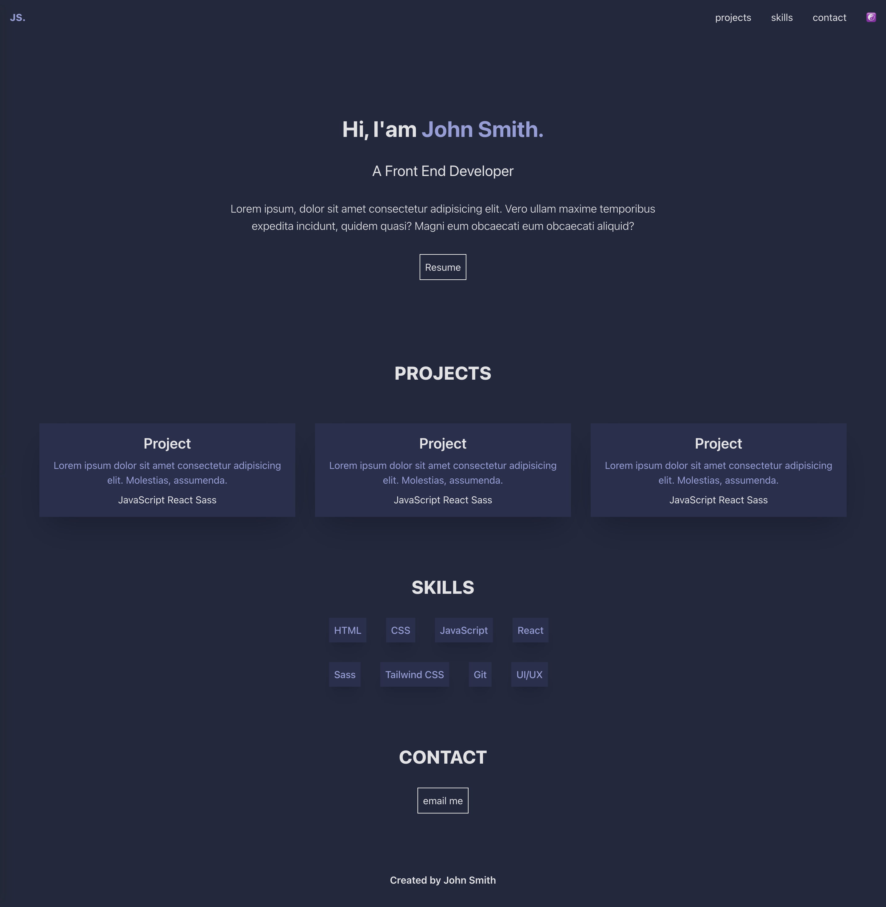

# Portfolio-Website mit React

Dieses Projekt ist eine Portfolio-Website, die mit React erstellt wurde.



## Projektstruktur

Das Projekt besteht aus folgenden Komponenten:

- Header
- Projects
- Skills
- Contact
- Footer

## Installation

Befolgen Sie diese Schritte, um das Projekt auf Ihrem lokalen Rechner auszuführen:

1. Klonen Sie das Repository:
   ```
   git clone [https://github.com/snahmd/aufgaben/tree/main/Modul_3/tag1_react_intro]
   ```
2. Wechseln Sie in das Projektverzeichnis:
   ```
   cd portfolio-mit-react
   ```
3. Installieren Sie die Abhängigkeiten:
   ```
   npm install
   ```
4. Starten Sie die Anwendung:
   ```
   npm run dev
   ```

## Verwendete Technologien

- React
- TypeScript
- Tailwind CSS

## Link

Projekt-Link: [https://github.com/snahmd/aufgaben/tree/main/Modul_3/tag1_react_intro](https://github.com/snahmd/aufgaben/tree/main/Modul_3/tag1_react_intro)
