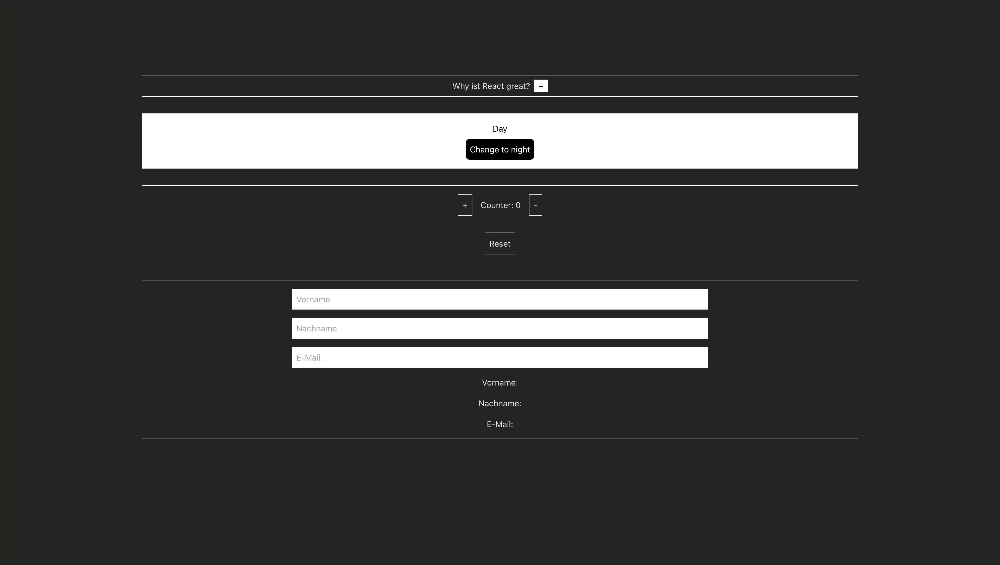

# React useState Aufgaben

## Über das Projekt

Dieses Projekt wurde mit React's useState Hook und Tailwind CSS entwickelt. Es demonstriert die Verwendung von State-Management und einem modernen CSS-Framework.

## Verwendete Technologien

- React
- useState Hook
- Tailwind CSS

