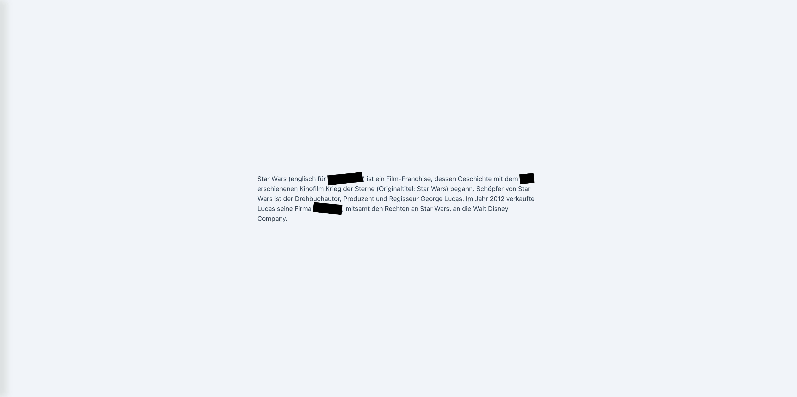

# React Spoiler Aufgaben

## Über das Projekt

Dieses Projekt wurde mit React's Child Props und Tailwind CSS entwickelt. Es demonstriert die Verwendung von Props und einem modernen CSS-Framework.

## Verwendete Technologien

- React
- Props
- Tailwind CSS

